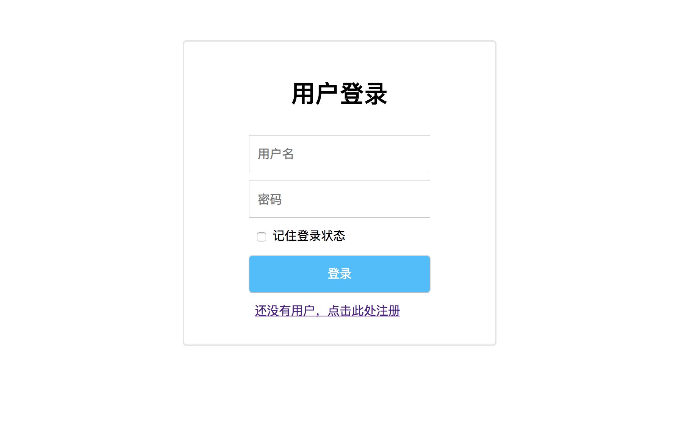
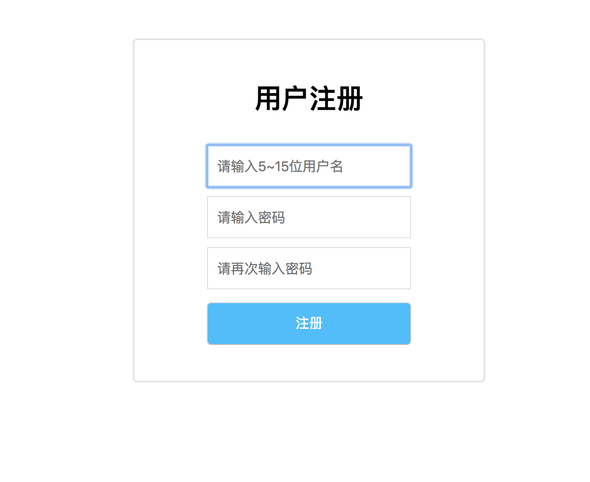
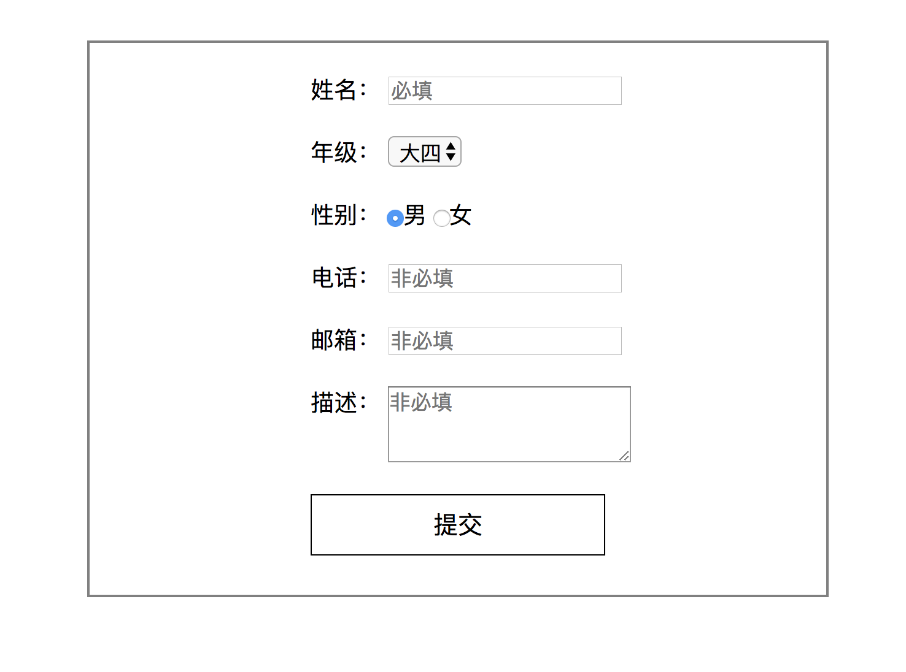
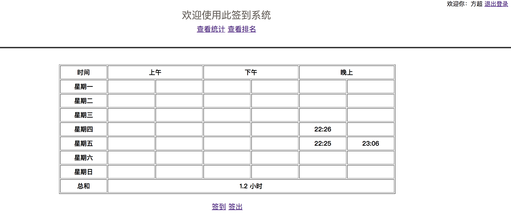
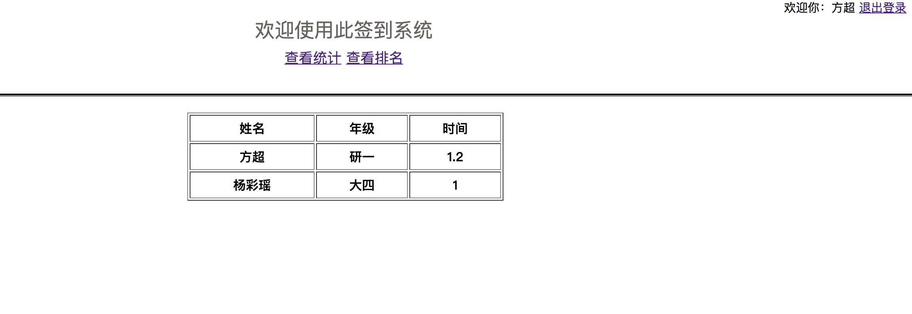

# 基于JSP+Servlet+MySQL的简单签到系统
此项目是我自学Java EE写的第一个demo，由于重点不在前端，所以前端代码混乱而且不美观，重点在于了解servlet以及Java Web基本知识。

##基本介绍
- 直接使用Servlet，没有用任何框架，采用MVC架构
- 数据库采用MySQL，使用了C3p0以及common_dbutils协助开发
- 日志记录采用log4j
## 签到规则
- 签到时间：上午：0~13点；下午：13~19点；晚上19~24点
- 签出前必须签到，不能重复签出和签到
- 签到不签出算半小时，签到签出不满半小时按半小时算
## 基本界面
- 登录界面

- 注册界面

- 完善信息界面

- 签到详情界面

- 签到排名界面

## TODO列表
- 签到排名进行分页
- 统计网站访问数并做持久化
- 支持用户查看、修改个人信息